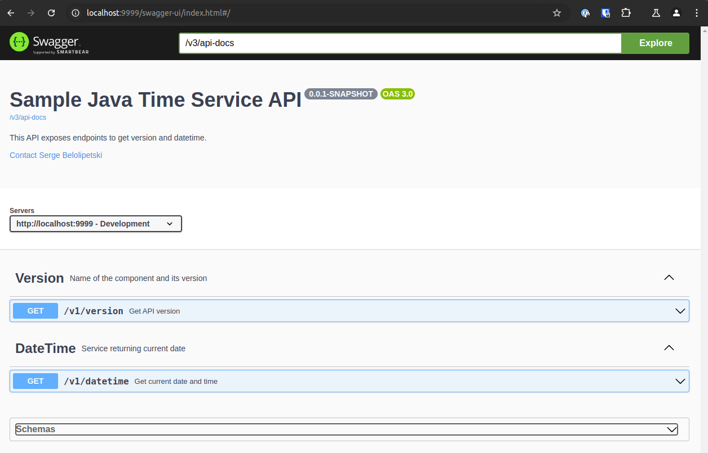
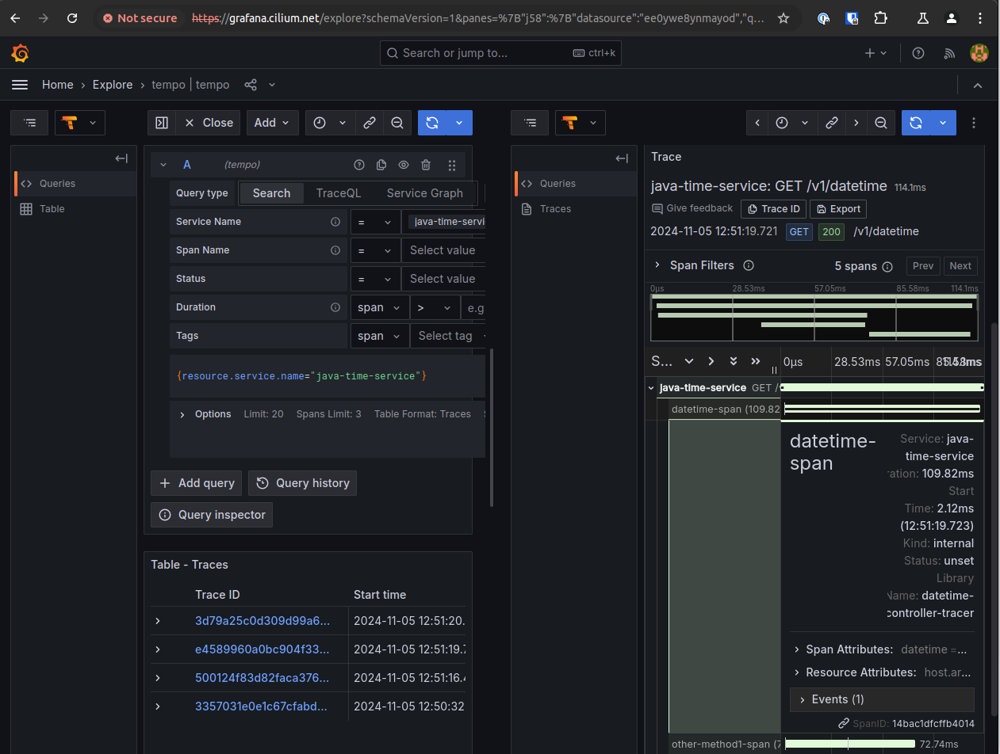
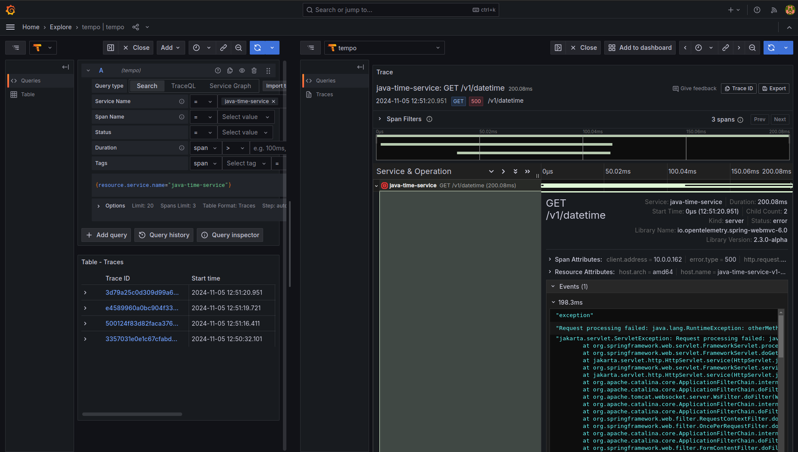

# java-time-service

This is a set of manifests kustomized during installation, to create or update `java-time-service` application exposed with Istio Ambient service mesh gateway.

## Install 

```shell
./install_app.sh
```

After the installation, there will be a folder `.target` created, where you can find the `kustomization.yaml` generated for producing `manifest.yaml`, which eventually goes to the cluster - the files kept on the filesystem just for the purpose of reviewing, and that can be safely removed.

## Call the deployed service

### Getting version of the service

Execute from terminal:

```shell
curl -k https://www.cilium.net/java-time-service/v1/version 
```

Response should be like this:

```json
{"name":"time-service","instance":"java-time-service-v1-5dcc4f7c64-gt2qt","version":"0.0.1-SNAPSHOT"}
```

### Getting date and time

```shell
curl http://www.cilium.net/java-time-service/v1/datetime
```

Response should be like this:

```json
{"dateTime":"Tue Nov 05 14:04:22 UTC 2024","instance":"java-time-service-v1-6f4599d87f-bt49m"} 
```

or like this (in case of error):

```json
{"timestamp":"2024-11-05T17:51:21.169+00:00","status":500,"error":"Internal Server Error","path":"/v1/datetime"}
```

## Swagger

### Instance in cluster

The `swagger.json` can be obtained from [http://www.your-domain.net/v3/api-docs](http://www.your-domain.net/v3/api-docs)

Browse Swagger-UI at [http://www.your-domain.net/swagger-ui/index.html](http://www.your-domain.net/swagger-ui/index.html)

### Local instance

The `swagger.json` can be obtained from [http://localhost:9999/v3/api-docs](http://localhost:9999/v3/api-docs)

Browse the Swagger-UI at [http://localhost:9999/swagger-ui/index.html](http://localhost:9999/swagger-ui/index.html)



## OpenTelemetry






## Uninstall

```shell
./uninstall_app.sh
```
